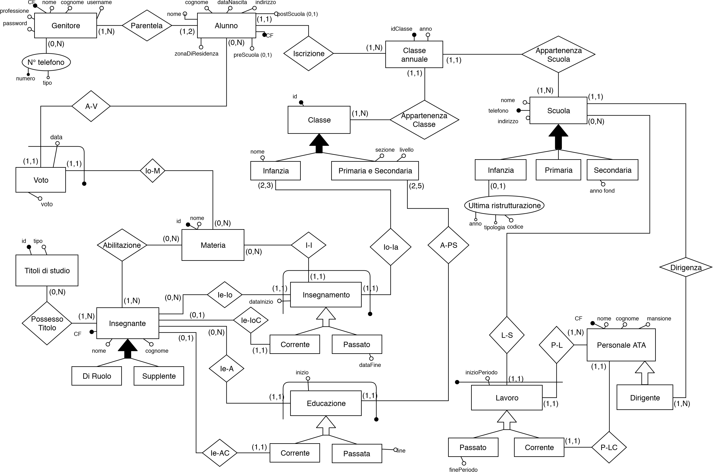
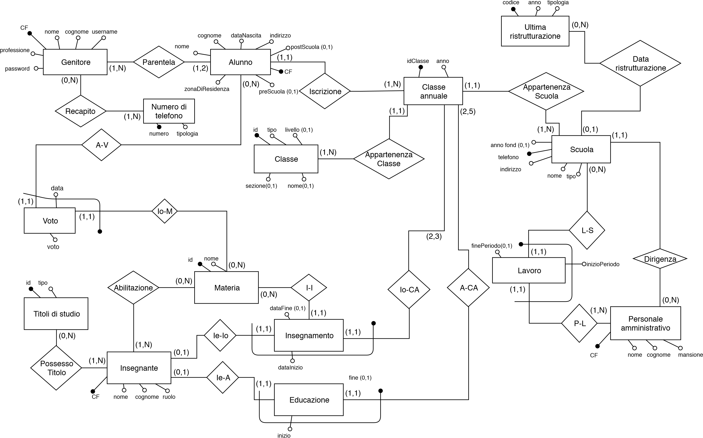
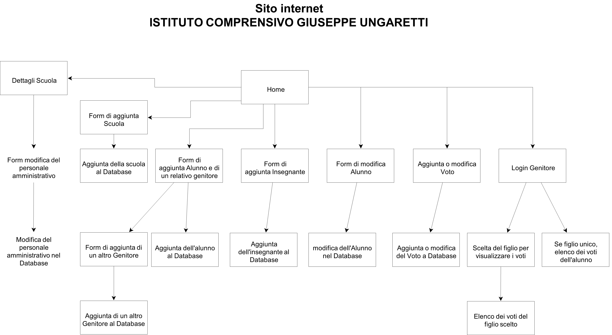

# Istituto Comprensivo Scolastico

*Università degli Studi di Milano*

*A.A. 2018/2019*

*Badi di Dati e web*

*Gianluca Rubino, Liliana Hu*

## Progettazione concettuale

### Schema ER

## Vincoli di dominio  
1.	Nelle scuole d’infanzia le classi sono formate da bambini con età compresa fra 3 e 5 anni.

2.	Il telefono di un genitore può essere nullo, ma un alunno deve avere almeno il telefono di uno dei genitori.

3.	Il pre-post scuola è un servizio dedicato ai soli alunni della scuola d’infanzia ed è facoltativo.

## Progettazione logica

### Schema ER ristrutturato  

### Vincoli di dominio  
1. Le classi primarie e secondarie sono identificate da un livello e una sezione. 

2. Le classi d’infanzia sono identificate da un nome. 

3. L’ultima ristrutturazione di una scuola ci interessa solo se d’Infanzia.

4. L’anno di fondazione di una scuola ci interessa solo se Secondaria. 

### Modello relazionale  
 
UltimaRistrutturazione(codice, anno, tipologia)

PersonaleAmministrativo(cf, nome, cognome, mansione)

Scuola(telefono, indirizzo, nome, tipo, annoFond, dirigente, ultimaRistrutturazione)

Genitore(cf, nome, cognome, professione, username, password)

TitoloStudio(id, tipo)

Materia(id, nome)

Insegnante(cf, nome, cognome, ruolo)

Classe(id, tipo, livello, sezione, nome)

Telefono(numero, tipologia)

Recapito(cfGenitore, nTelefono)

PossessoTitolo(cfInsegnante, idTitoloStudio)

Lavoro(cfPersonaleAmm, telScuola, inizioPeriodo, finePeriodo)

Abilitazione(cfInsegnante, idMateria)

ClasseAnnuale(idClasse, anno, telScuola, classe)

Alunno(cf, nome, cognome, dataNascita, zonaResidenza, indirizzo, preScuola, postScuola, classe)

Parentela(cfAlunno, cfGenitore)

Voto(data, voto, cfAlunno, idMateria)

Educazione(inizio, fine, cfInsegnante, classeAnnuale)

Insegnamento(dataInizio, dataFine, cfInsegnante, idMateria, idClasse)

